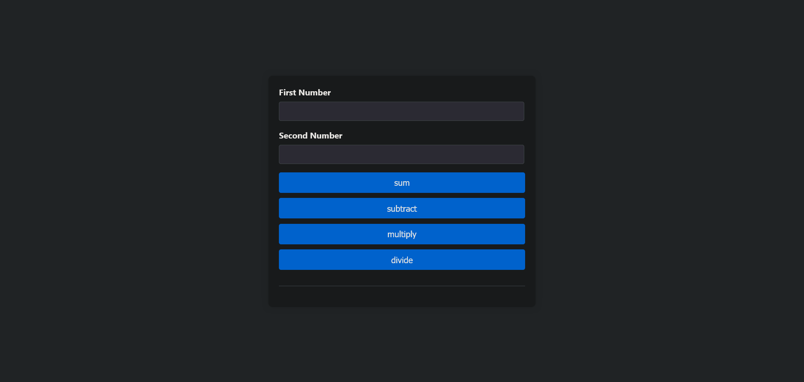

# React Calculator with useReducer

## Description

This is a React calculator project that implements the `useReducer` hook for educational purposes. The project demonstrates how to manage complex state logic in a React application using `useReducer`.



## Installation

To install the project, clone the repository and run:

```bash
git clone https://github.com/mohammed-bakkali/react-calculator-use-reducer.git
cd react-calculator-use-reducer
npm i install
npm start
Open your browser and go to [http://localhost:3000](http://localhost:3000) to see the app in action.

## Contact

For any questions or feedback, please reach out to:

- **Name**: Mohammed Bakkali
- **Email**: [mohammed.bakkali807@gmail.com](mailto:mohammed.bakkali807@gmail.com)
- **Website**: [mohammed-bakkali.netlify.app](https://mohammed-bakkali.netlify.app/)
- **Phone**: +212 722-923357
- **City**: Tanger
- **Role**: Web Developer
```
